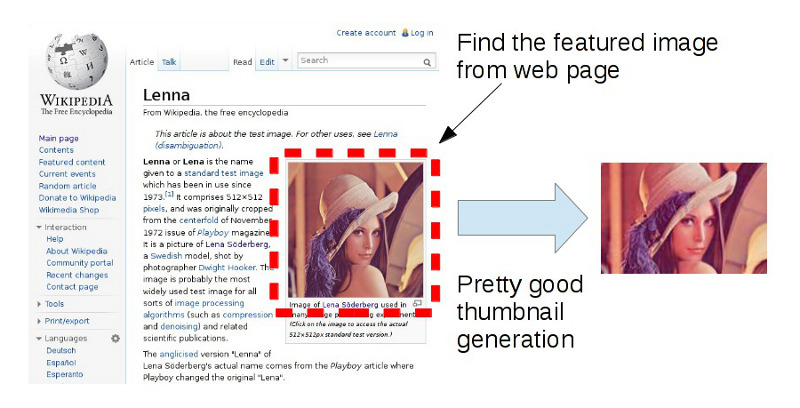

# FeaturedImage



## What is FeaturedImage?

FeaturedImage is a finder that extract featured image from a web page.

FeaturedImage::Finder analyses a web page using Mechanize, downloads images which are referenced by IMG tags in HTML file, and specifies featured images based on size of image using RMagick.

Furthermore, FeaturedImage has pretty good thumbnail generating functions. FeaturedImage::Converter crops centered area of image, resizes, and converts to an arbitrary format automatically.

## Usage

```ruby
require 'featuredimage'

# find first featured image from a web page
featuredimage = FeaturedImage::Finder.first('http://en.wikipedia.org/wiki/Lenna')

# convert featured image to thumbnail
thumbnail = FeaturedImage::Converter.convert(featuredimage, 180, 120) # return BLOB

# save BLOB
open('thumbnail.jpg', 'w'){|f| f.write thumbnail}
```

## API Reference

### Basic API

<table>
<tr><th>API</th><th>Description</th></tr>
<tr>
<td>FeaturedImage::Finder.first</td>
<td>Finds the first featured image that matches the specified criteria from the web page. Returns an image as Magick::ImageList if any featured images exist; otherwise, nil.</td>
</tr><tr>
<td>FeaturedImage::Finder.biggest</td>
<td>Finds the biggest featured image that matches the specified criteria from the web page. Returns an image as Magick::ImageList if any featured images exist; otherwise, nil.</td>
</tr><tr>
<td>FeaturedImage::Finder.all</td>
<td>Finds all featured images that match the specified criteria from the web page. Returns an Array of image as Magick::ImageList if any featured images exist; otherwise, nil.</td>
</tr><tr>
<td>FeaturedImage::Converter.convert</td>
<td>Converts an image to an arbitary sized thumbnail and returns its BLOB. The default thumbnail format is JPEG with compression quality at 60. This is the same as `FeaturedImage::Converter.convert(IMAGE, WIDTH, HEIGHT, {format:"JPEG", quality:60}).`</td>
</tr>
</table>

Also, you can use FeaturedImage::Finder and FeaturedImage::Converter instance directly, if you want. See source code.

### Criteria

FeaturedImage::Finder APIs receive various argument about featured image criteria. Some examples follow.

Empty criteria. Anything image is match as featured image.

```ruby
FeaturedImage::Finder.first URL
```

Aspect ratio range criteria. Featured image aspect ratio restrict 4:3 to 16:9. See also _Aspect Ratio_.

```ruby
FeaturedImage::Finder.first URL 1.2..1.8
```

Minimum size criteria. Minimum featured image size is 320x240.

```ruby
FeaturedImage::Finder.first URL 320 240
```

Minimum size criteria with aspect ratio range restrict 4:3 to 16:9.

```ruby
FeaturedImage::Finder.first URL 320 240 1.2..1.8
```

Minimum and maximum size criteria. Featured image size is 320x240 to 1024x768.

```ruby
FeaturedImage::Finder.first URL 320 240 1024 768
```

The most restricted criteria. Featured image size is 320x240 to 1024x768, and aspect ratio restrict 4:3 to 16:9.

```ruby
FeaturedImage::Finder.first URL 320 240 1024 768 1.2..1.8
```

### Aspect Ratio

In FeaturedImage, aspect ratio is defined as WIDTH / HEIGHT.

Examples.

- Aspect ratio 1.0 is square.
- Aspect ratio 0.5 is vertically long rectangle. HEIGHT is twice as much as WIDTH.
- Aspect ratio 2.0 is holizontally long rectangle. WIDTH is twice as much as HEIGHT.

# Auther

- [xmisao](http://www.xmisao.com/)

# License

This library is distributed under the MIT license.
